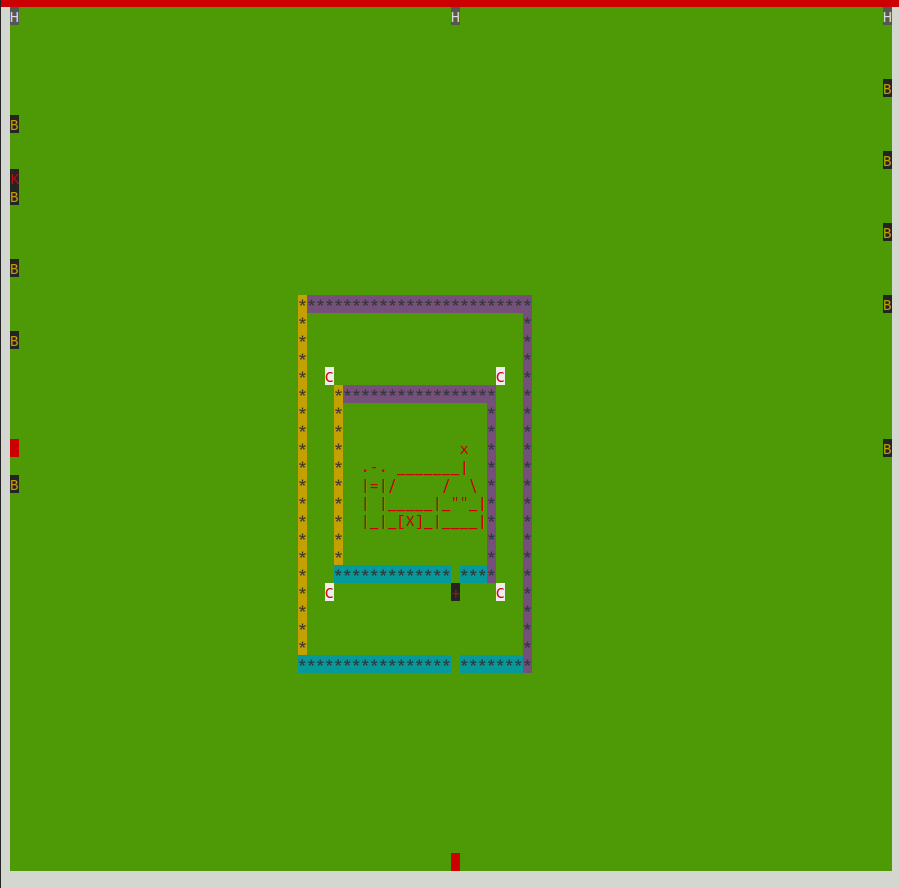

# Clash with Clans

- A Terminal Based imitation of Clash of Clans. Developed in python using OOPS concepts. 

Hariharan Kalimuthu, 2020115015 

## Features

1. King 
   1. Controls : 
      1. <KBD>W</KBD> - up movement
      2. <KBD>A</KBD> - left movement
      3. <KBD>S</KBD> - right movement
      4. <KBD>D</KBD> - down movement
      5. <KBD>SPACE</KBD> - attack
2.  Queen 
    1.  Controls : 
      1. <KBD>W</KBD> - up movement
      2. <KBD>A</KBD> - left movement
      3. <KBD>S</KBD> - right movement
      4. <KBD>D</KBD> - down movement
      5. <KBD>SPACE</KBD> - normal attack
      6. <KBD>F</KBD> - Eagle eye special attack 

3. Barbarians 
   1. Automated troops that can be spawn using the <KBD>Z</KBD> , <KBD>X</KBD> , <KBD>C</KBD> , that are generated from the 3 spawning points , and move, target the nearest buildings.
   2. A max barbarians that can be deplayed is capped at 6 
   
4. Archers 
   1. Automated troops that can be spawn using the <KBD>4</KBD> , <KBD>5</KBD> , <KBD>6</KBD> , that are generated from the 3 spawning points , and move, target the nearest buildings.
   2. A max barbarians that can be deplayed is capped at 6 
   
5. Balloons 
   1. Automated troops that can be spawn using the <KBD>1</KBD> , <KBD>2</KBD> , <KBD>3</KBD> , that are generated from the 3 spawning points , and move, target the nearest buildings.
   2. A max barbarians that can be deplayed is capped at 3
   
6. Cannons
   1. Shoot and kill the nearest enemies
   2. Cannot shoot Balloons

7. Wizard Towers 
   1. Shoot and kill all types of troops 
8. Spells 
   1. 2 spells of each type, heal and rage have been given for a game 
   2. for heal spell use <KBD>H</KBD> and for rage spell use <KBD>R</KBD>
9.  Replay 
   1. Replay feature has been implemented 
   2. run the command  `python3 replay.py`
10. Impressive UI and Design of the game!!

Enjoy !!!!!!

#### Some Screenshots

#
